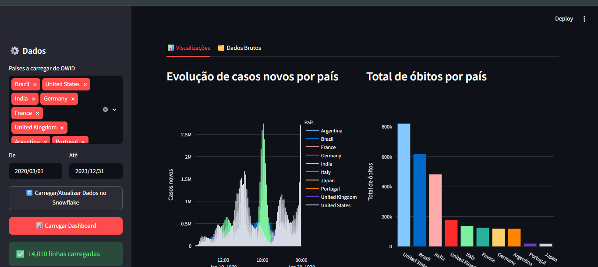

# Dashboard COVID

Este projeto apresenta um dashboard interativo para acompanhar os principais indicadores da COVID-19 em um formato visual e intuitivo. 
Ele reúne dados relevantes em gráficos e métricas para facilitar a análise de tendências e variações ao longo do tempo. 
A interface foi desenvolvida para oferecer uma navegação simples e rápida, com foco em clareza e entendimento dos dados. 
O painel permite comparar períodos, observar padrões de crescimento e identificar momentos de maior impacto. 
A proposta do projeto é transformar informações complexas em uma visão acessível para usuários e gestores. 
Essa solução pode ser usada como base para relatórios, acompanhamento de indicadores e tomada de decisão.

## Preview do Dashboard

## Aplicação Streamlit

Link da aplicação: [DashBoard Covid](https://dashboard-covid-jheimis.streamlit.app)
